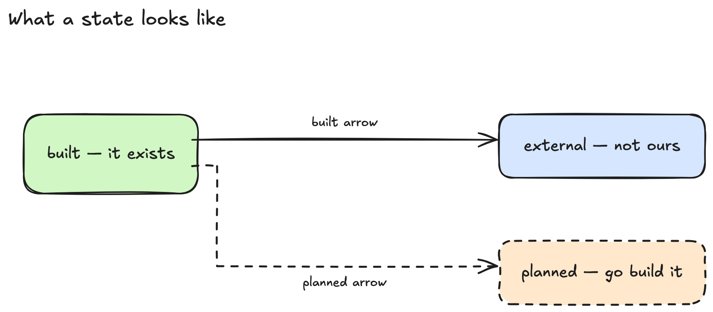

# Drift check: keeping a diagram honest about the code

Status: **missing files, symbols, and edge mismatches are built** — `src/engine/drift.ts`,
the `check_drift` tool, `scripts/check-drift.mjs`, and a `Stop` hook in
`.claude/settings.json`. All three kinds are now built; the rest of this file is the
reasoning behind the complete picture.

Fixing is a `/update-diagram` command, and deliberately not automatic. See
"Reporting is not the same as being actionable" below for why the exit-2
auto-fix was designed and then not built.

What changed while building it:

- **Labels that are unambiguously paths are read as refs**, reported as
  `inferred`. Without this, every diagram drawn before `ref` existed was
  invisible to the check. The pattern demands a slash and a file extension, so
  `Auth` and `POST /api/file` are still skipped.
- **`Stop`, not `PostToolUse`.** One run per turn instead of dozens, output
  arriving when the model could act on it, and no debounce logic to get wrong.
- **Silent when clean**, which matters more than it sounds: a check that
  announces good news thirty times an hour gets switched off.
- **The plugin ships the hook** (`hooks/hooks.json` + `hooks/drift.sh`), which
  reverses an earlier decision. It was opt-in because a plugin hook fires in
  every project someone installs into and most have no diagrams — sound, and it
  left the one feature that keeps a diagram honest as the one feature every user
  had to wire up by hand after reading this file. Nobody was going to. See
  "Shipping the hook" below for the measurement that made the objection cheap to
  answer.
- **Refs are confined like board paths.** They are model-authored strings that
  become filesystem reads, so they resolve inside the root and are re-checked
  after realpath; a symlink out of the tree cannot be used to probe for files.

A committed diagram is documentation, and documentation rots. The point of
diagram-driven development is that the picture stays true, so the board needs a
way to notice when the code has moved out from under it.

## What makes this tractable here

Generated elements carry `customData` (`{ node, edge, edgeLabelFor, role, origin }`),
so `readGraph()` returns an exact node and edge list rather than something
re-derived from geometry. Drift detection is therefore a real set comparison,
not fuzzy matching against rectangles.

Hand-drawn elements are reported as `provenance: "inferred"`. They must be
treated differently: a box you sketched is an *intention*, not a claim about
current code, and reporting it as drift would be noise.

Arrows are the exception, and the distinction is not authorship. Each edge also
reports `endpoints`: `declared` (from its own `customData`), `bound` (from
Excalidraw's bindings on both ends), or `nearest` (at least one end matched to
whichever shape it landed close to). The first two are exact — a binding keeps
pointing at a shape when either one moves, whoever drew the arrow — so the arrow
check trusts them and skips only `nearest`. Keying that decision on `provenance`
instead meant "Claude didn't draw it", which silently skipped the diagram-driven
case: a connection you sketched between two components that already exist.

## What the diagram says about time

A ref that does not resolve means one of two opposite things, and the filesystem
cannot tell them apart: either the code has not caught up yet, or the code moved
out from under the diagram. Nothing could distinguish them, so everything was
reported as the second one — which is why a diagram could not be used as a spec.

A node (and an edge) can now declare `state`:

| state | meaning | drawn |
| --- | --- | --- |
| `built` | it exists now. The default, so every board drawn before this field means exactly what it meant | solid |
| `planned` | it is meant to exist | **dashed** |
| `external` | deliberately not code in this repo — a browser, a third-party service, another project | solid, for now |

`planned` boxes and arrows are drawn dashed, so what exists and what does not can
be told apart by looking rather than by running the check. Dashed rather than a
colour: it survives greyscale and colour-blindness, and it is already what "not
real yet" looks like everywhere else.



That picture is generated, not a screenshot:
`npm run diagram:render docs/diagrams/state-legend.excalidraw assets/state-legend.png`.
Regenerate it if the styling ever changes, so the legend cannot quietly start
lying about what the tool draws.

`external` is drawn like `built` on purpose. It means "real, but not ours" rather
than "not real yet", so it wants a treatment of its own rather than being folded
into the same one — an open question, not an oversight.

Crossed with what the filesystem observes, every combination has one honest
reading:

| declared | observed | report |
| --- | --- | --- |
| `planned` | missing | **work item** — go build it |
| `planned` | exists | **promotion** — the code caught up, the board can be advanced |
| `built` | missing | **regression** — real drift |
| `built` | exists | nothing |

The third row is the only one that fails a build. Work items and promotions are
kept out of `clean` and out of the exit code on purpose: CI reads that code, and
a repository is not broken because somebody sketched next week's work.

**`missing` is deliberately not a state.** State is declared by whoever draws the
box; existence is observed, free, every run. Recording "missing" would put a fact
with a shelf life into a committed file, which is the rot this check exists to
catch. Never store what you can measure.

**A promotion opens the notice; a work item does not.** Both come from a `planned`
box, and the difference is which side is behind. A work item is the sketch being
ahead on purpose — it would sit unchanged for a whole design session, and a notice
repeating it every turn is one nobody reads. A promotion means the board is now
wrong: it says planned, the code says built. That is drift in the mild direction,
and it is one edit from going away. Work items still show up in the tally
(`1 gone  1 planned`), so they are discoverable, and `--details` lists them in
full — being quiet is not the same as withholding.

**The hook makes that one edit itself.** On the per-turn path a promotion is
applied, not just announced: the box is flipped to exactly what regenerating it
as `built` would write — solid stroke, no state key, version bumped so the live
page redraws it — and the notice says `promoted` once instead of `is built now`
forever. On a live board the box turns solid the moment the work lands, which is
the loop this whole field exists for. Two deliberate limits: a box only partly
landed — several anchors, some still missing — is held, because flipping it
would erase the remaining work from the picture; and only the hook applies,
never the bare `drift` command, because a check that mutates the working tree
breaks every `git diff --exit-code` that CI runs after it. The applied edit is
an ordinary change to a file in git, so undoing it is one checkout.

`external` earns its place separately. Measured: 106 of 117 nodes in this repo's
diagrams carry no ref, and some of that is deliberate — the telecom boards
describe a protocol, not this repository. Without a way to say so, "not code" and
"somebody forgot" are the same output.

That distinction is mostly a property of a whole board rather than a box, so a
board can also carry `describes: "concept"`, recorded on its **title element**.
Not `appState`: the viewer pushes `appState: {}` on every browser edit, so
anything kept there is destroyed the first time someone touches the canvas.
Element `customData` is the only store that survives, which is why a concept
board needs a title.

## What the board stopped saying

Every check above reads the board as it is, so deleting a box deletes the findings
about it. Measured: removing one box from `board-internals.excalidraw` — the
`layout` box, whose file is 23KB and imported by three modules including this
checker — dropped the refs checked from 12 to 11 and the edges from 13 to 11, and
reported **nothing**. Taken to its conclusion, the least honest diagram is the
quietest one, and an empty board is clean forever.

So one finding comes from a comparison against the *committed* board rather than
against the code: a box that was there, is gone, and whose file is still in the
tree.

**Committing the diagram is the mute.** There is no flag to remember and no
per-box suppression, because the act that means "yes, I meant to remove that" is
one people already perform. It also means CI can never trip this: a fresh checkout
has nothing uncommitted to find.

Tombstones were the cheaper design and were rejected. Excalidraw soft-deletes, so
the removed element is still in the file with `isDeleted: true` and its
`customData` intact — but a tombstone lives forever, so an old deliberate deletion
and a fresh accidental one look identical, it would need a mute of its own, and
exporting from another editor prunes them.

Matching is on the semantic node id, never the element id: regeneration writes
fresh elements and keeps node ids, so anything keyed on elements would report
every redraw as a mass deletion. A node still present with a different ref is not
a deletion either — the ordinary checks own that.

Three silences, each load-bearing:

| situation | why nothing is said |
| --- | --- |
| the file went with the box | the deletion tracks the code, so the board is telling the truth |
| no git, untracked board, or board unmodified | nothing to compare against. A project without git is not a broken one |
| the box was `external` | it never claimed anything about this repo |

The cheap path is the common one: `git status --porcelain` on the board runs
first, and an unmodified board stops there without reading a baseline.

### Deleted arrows

When an arrow is removed from the board, the check can detect if the code still supports that connection. If both endpoints exist in the code and have corroboration (one imports the other, they share an importer, or they share a route string), the removal is reported as a quiet note beside the deleted boxes, never a finding.

A deleted arrow is not reported when the connection had no corroboration anyway — removing an uncorroborated arrow is cleanup, not loss.

### Stray arrows

An arrow that fails to resolve at one or both ends is an incomplete stroke, not a specification. These arrows never make it into the graph's edge list — they drop out when both binding and proximity matching fail to find a target, which is exactly the "never surfaces anywhere" silence described by the issue.

They are counted and reported as a dim note when `--details` is asked for, so an incomplete sketch does not clutter the main notice. Arrows that resolve at both ends, whether through Excalidraw bindings or explicit declaration, are specifications and are checked normally.

## Code the diagram does not show

Every other check reads a claim and asks whether it still holds. This one asks the
opposite: what does the code have that the board leaves out?

It was the oldest open question here, and it was stuck on one thing — **without a
relevance bar, every file in the repository is drift.** Picking a bar (line count,
export count, directory depth) means inventing a definition of "important" and
being wrong about it in someone else's project.

The bar is inherited instead of invented:

> A candidate has to be imported by a file the board already points at.

Relevance was decided by whoever drew the diagram. Cost scales with the diagram
rather than the repository, nothing searches the tree, and the machinery already
existed — the arrow check builds the same neighbourhood for its shared-importer
channel.

The frontier moves with the board. Draw a suggested module and its own imports
become the next candidates, so the check keeps proposing the next ring outward
instead of emptying once and going quiet. That is also why it stops at one hop:
following further is the walk this was avoiding.

A directory ref covers everything beneath it, so one box for `src/engine/` excuses
the subsystem rather than nominating all of it.

**Suggestions, never drift.** They stay out of `clean` and out of the exit code,
they need `--coverage` on the CLI or `coverage: true` on the tool, and the `Stop`
hook never passes either. Whether a module deserves a box is a judgement about
what is worth showing; a check that nagged about it every turn would be switched
off, and that would take the quiet, correct missing-file check with it.

Measured on `board-internals.excalidraw` — 12 boxes, the only ref'd board here —
it suggests **7 files in 15 ms**, ranked by how many boxes import them:

| suggested | imported by |
| --- | --- |
| `src/engine/normalize.ts` | 4 |
| `src/engine/config.ts` | 2 |
| `src/engine/font.ts` | 2 |
| `src/engine/contrast.ts`, `src/engine/excalidraw-assets.ts`, `src/viewer/reveal.ts`, `src/viewer/sync.ts` | 1 each |

No threshold is applied, and that is a deliberate omission rather than an
oversight: every one of those seven is a real module (58–256 lines), so there is
no obvious noise to filter, and any cutoff picked from a single 12-box board would
be a guess dressed as a rule. Ranking puts the module four boxes depend on first
and lets the reader stop whenever they like. If a real diagram drowns in these,
that is the measurement that earns a threshold.

## Silence had two meanings

The check is quiet when nothing is wrong, which is what keeps it switched on. But
it was equally quiet when there was nothing it could read, and the output was
identical. So a clean report was not evidence of anything: you could not tell a
verified diagram from an unreadable one.

Measured on this repo, which had been reporting clean every turn for months:

| | |
| --- | --- |
| boxes checked | **12 of 117** |
| arrows checked | **12 of 153** |
| boards with anything checkable | **1 of 7** |

Every check now records *why* something went unread, not just how many. Two
reasons for a box (`no-ref`, `ref-outside-repo`) and nine for an arrow — the one
that matters most being `ends-not-bound`, because an arrow that was never snapped
to its boxes looks exactly like one that was.

Three things stay separate, because they are not the same claim:

- **skipped** — there was something here and it could not be read.
- **excused** — declared as not about this repo (`external`, or a concept board).
- **hand-drawn** — a sketch, never a claim about code.

`--details` prints this even when everything is clean, since a question deserves
an answer:

```
┌─ ims.excalidraw  0 refs · 0 arrows checked ───────────────────┐
│ 19 boxes skipped: 19 no ref                                   │
│ 25 arrows skipped: 25 an end has no ref                       │
└─ silence means these agreed · not that everything was read ───┘
```

**An unread arrow is named, not just counted.** A reason with no subject cannot
be acted on — "4 arrows skipped: an end is marked external" leaves a reader no way
to learn *which* four short of opening `drift.ts`:

```
┌─ example.excalidraw  3 refs · 2 arrows checked ───────────────┐
│ 3 boxes outside this repo by declaration                      │
│ 4 arrows skipped: 4 an end is marked external                 │
│   Claude Code → Board MCP server  tool call                   │
│   Board MCP server → board.excalidraw  writes                 │
│   board.excalidraw → Board MCP server  reads back             │
│   You → board.excalidraw  edits                               │
└─ silence means these agreed · not that everything was read ───┘
```

This is the argument `unannotated` already won for boxes, applied to arrows,
which never got the same treatment. It measures nothing new and catches nothing
by itself: silence had two meanings — *this agreed with the code* and *nobody
looked* — and from outside the tool they were indistinguishable. The cost of that
is not hypothetical. `example.excalidraw` carried an arrow reading **ELK layout
engine → board.excalidraw, "writes"** from the first commit. It was false —
`writeBoard` is called in `src/mcp/server.ts`, and nothing in `layout.ts`'s
import chain touches `node:fs` — and every run said nothing, because an arrow
onto an `external` box is dropped before anything looks at it. It was found by
reading this file, which is not a route a user has.

Named unconditionally, unlike `unannotated` and `unrepresented`. Those two go
looking for something and wait to be asked; this only writes down a decision the
check already made, so deferring it would buy nothing and would leave `--details`
— the flag whose whole job is saying what was not read — unable to answer its own
question. The list stops at eight per reason and says how many it held back: a
list that quietly stopped would read as "that is all of them", which is the
failure being fixed rather than a smaller version of it.

**What it still cannot do.** Naming the arrow does not check it. The claim in
that arrow was the word *"writes"*, and labels are decoration to this tool —
nothing in `drift.ts` reads `edge.label`. Every channel the arrow check has asks
*does the code at this end reach the code at that end*, and with a person or a
drawing file at one end there is no other end to reach. So the honest position is
that these arrows carry no claim this check can test, and the fix is to say so
out loud rather than to guess. What to do about it is tracked separately.

**The per-turn notice does not change.** It stays quiet, because a notice that
reported coverage every turn is one that gets switched off — and that would take
the quiet, correct missing-file check with it. The audit is a question you ask.

**A bare run answers in one line.** The silence above was applied to both callers,
and only one of them deserved it. Typing the command and getting zero bytes back
is indistinguishable from a broken install, and was read as exactly that:

```
7 boards · 12 refs · 12 arrows checked · nothing drifted · 12 unread, --details says why
```

It names what went unread rather than implying everything was verified, because
that conflation is the thing this section exists to undo, and a summary line that
forgot it would put the confusion back in a shorter form. Work items ride along as
`· 2 planned` — in the tally, never in an alarm.

The asymmetry is the point: the hook fires unbidden and stays silent, a command
someone chose to run gets an answer. The same line `--details` already draws.

`check_drift` returns `skippedWhy` and `edgesSkippedWhy` alongside the counts, so
a model deciding whether a diagram is trustworthy has the same information, and
`coverage: true` adds `unreadEdges` — the same arrows by name. That one is gated
where the CLI's is not, because the MCP response is read every turn and the
counts already answer the per-turn question.

Most of the 105 unread boxes are the telecom boards, which describe a protocol
rather than this repository. Marking them `describes: "concept"` turns them from
*skipped* into *excused*, which is the honest resolution — see #32.

## What a box is allowed to say

A ref used to be one of two things: this file exists, or this file mentions this
name. Measured across the seven committed diagrams, the second had **never been
used once in 117 nodes** — the check was strongest at the claim people least
wanted to make, and had nothing to offer for the ones they actually draw.

Six forms now, four of them new:

| form | example | claim |
| --- | --- | --- |
| file | `src/engine/drift.ts` | this file exists |
| symbol | `src/engine/drift.ts#checkDrift` | the file mentions this name |
| directory | `src/engine/` | this directory exists and is not empty |
| dir symbol | `src/engine/#Workspace` | some file directly inside mentions it |
| glob | `src/engine/*.ts` | at least one file matches |
| several | `refs: ["src/lib.rs#LOGGER", "src/lib.rs#log_line"]` | all of these hold |

A trailing slash **says** directory. That is the point of allowing it: what
`src/engine` means should not depend on what happens to be on disk the day it is
read, and `src/engine/layout.ts/` is now a finding rather than a coincidence.

`refs` sits beside `ref`, never replacing it. Each anchor is checked and reported
on its own, and the box is clean when all of them hold — so #18's real case, one
box meaning a static *and* the macro that uses it, goes loud when either
disappears, which neither single-ref option could do. `ref` stays primary because
the arrow check needs one endpoint per box, not a set.

One new finding: `empty-ref`, for a directory with nothing in it or a glob that
matches nothing. It is loud, because it is a claim that has stopped being true.

### The glob restriction is the security design

`*` is allowed in the **last segment only**, and `**` never. The directory prefix
stays literal, so expansion is one listing of one directory, through `Workspace`,
which confines to the root and re-checks after `realpath`.

Refs are model-authored strings that become filesystem reads. A syntax able to
express "search the repo" is a disk-probe surface, not merely a cost problem, and
`src/*/layout.ts` is refused for that reason rather than because it would be hard
to support.

Directory and glob anchors also stop at **50 entries**. Past that the anchor is
skipped and counted rather than guessed at: a box standing for a thousand files is
not making a checkable claim, and reading them on every turn is not a per-turn
budget.

### The migration, and what it was worth

Five boards were marked `describes: "concept"` — the telecom ones, plus
`auth.excalidraw`, which despite its name is titled *"Wiley / board-ai
architecture"* and describes a different software project. They were picked by
reading titles and node labels, not filenames, which mislead here:
`architecture.excalidraw` is the IMS diagram.

| | before | after |
| --- | --- | --- |
| boxes checked | 12 | 12 |
| boxes **unexplained** | **105** | **5** |
| boxes excused by declaration | 0 | 100 |

Nothing new is checked. What changed is that the check no longer implies 105
boxes are missing annotations someone forgot: 100 of them were never claims about
this repository. The remaining five are `example.excalidraw`, which is genuinely
mixed — "Board MCP server" and "ELK layout engine" are this repo, "Claude Code"
and "You" are not — and needs per-box work rather than a board-level flag.

That per-box work has since been done, by following `/annotate-diagram`: two
boxes anchored, three declared `external`, and no box left unexplained. It cost
one box on the diagram. Anchoring both ends of "Board MCP server → ELK layout
engine" made that arrow flag, correctly — the server calls `diagram.ts`, which
calls the layout engine — so the board gained a "Diagram builder" box rather than
a looser anchor. The board now contributes 3 refs and 2 arrows to the check that
it contributed nothing to before.

## Two jobs, deliberately separate

| | Cost | Needs a model | When to run |
| --- | --- | --- | --- |
| **Detection** — does the diagram disagree with the code? | milliseconds | no | every edit, pre-commit, CI |
| **Regeneration** — what should the diagram now say? | a model call | yes | when a human or the drift report asks |

Keeping these apart is the whole design. Detection is deterministic and safe to
run constantly; regeneration is a judgement call about what is worth showing and
should not fire on every keystroke.

## What "drift" means concretely

A diagram node claims a thing exists. Drift is a mismatch between that claim and
the repository. Three kinds, in descending confidence:

1. **Missing** — a node names a module, file, or symbol that no longer exists.
   High confidence, almost always actionable.
2. **Unrepresented** — a significant module exists in the code but appears
   nowhere on the board. Built, on demand only; see "Code the diagram does not
   show" for how the relevance question was answered.
3. **Edge mismatch** — the diagram draws `A → B` but nothing in `A` imports or
   calls `B`, or a real dependency is undrawn. The most valuable signal and the
   most likely to produce false positives.

Start with (1). It is nearly free and nearly always right. Add (2) and (3) only
once (1) is quiet in practice.

## Binding nodes to code

Detection needs to know what a node refers to. Guessing from the label is
unreliable ("Auth" could be anything). Better: let a node record its referent
explicitly.

```jsonc
// customData on a generated node
{ "node": "layout", "ref": "src/engine/layout.ts" }
```

Add an optional `ref` to the `create_diagram` node schema — a repo-relative path
or a `path#symbol`. Nodes without a `ref` are simply skipped by detection rather
than guessed at. Opt-in keeps false positives near zero, which is what decides
whether anyone leaves the check switched on.

## Tool and script surface

- `check_drift(path)` — MCP tool. Returns `{ boards[], clean: boolean, findings[], edges[] }`,
  plus `deleted[]`, `workItems[]`, `promotions[]`, `conceptBoards[]`, `unannotated[]`,
  `unreadEdges[]`,
  `unrepresented[]`, `skippedWhy`, `edgesSkippedWhy` and `assertions` when non-empty.
  A new `DriftKind` is a new member of `findings[]`, not a new array: the handler
  spreads each finding generically, so it needs no change beyond its description.
  Read-only; never edits the board.
- `scripts/check-drift.mjs <board>` — same logic, CLI, non-zero exit when drift
  is found. This is what hooks and CI call.

Sharing one implementation in `src/engine/drift.ts` keeps the tool and the
script from disagreeing.

## Wiring it to fire automatically

MCP is pull-only: a tool sits there until the model calls it. Automatic
behaviour has to come from the harness.

- **Soft** — a line in the plugin skill: regenerate the affected diagram after
  changing module structure. Usually works, not guaranteed.
- **Hard** — a `Stop` hook runs `check-drift.mjs` once per turn. The harness
  executes it whether or not the model remembered. This is what is built.
- **Hardest** — pre-commit or CI, catching drift introduced without Claude. The
  script's exit code is there for it, and the README now carries the one-line
  recipe. Nothing in this repository's own CI runs it yet.

## Shipping the hook

The `Stop` hook lived in this repository's `.claude/settings.json` and nowhere
else, so the check ran here and for nobody else. The stated objection to shipping
it — a subprocess on every turn in projects with no diagrams — turned out to be
cheap to answer, once measured in a git repo with no diagrams at all:

| path | cold | warm |
| --- | --- | --- |
| `node out/cli/diagramos.mjs drift --hook` | 320 ms | 60 ms |
| `npx -y diagramos drift --hook` (what a plugin user pays) | 540 ms | **260 ms** |

Silent, exit 0. And nearly all of that is npx and node starting up rather than
work: the script already finds no diagram directory and stops. So there was
nothing left to optimise inside it, and the saving had to happen *before* it is
launched. `hooks/drift.sh` is that guard, and it is two tests:

```sh
[ -d docs/diagrams ] || [ -f .diagramos.json ] || exit 0
```

Both are needed. The diagram directory is configurable, so testing only the
default would silently skip every project that moved it — checking nothing while
appearing to work, which is the failure this whole area exists to catch.

Three details that are each one bug:

- **A shell script invoked through `sh`, not an inline command.** Installing a
  plugin copies files into a cache, and relying on the executable bit surviving
  that is a guess; `sh path` needs no `+x`. It also puts this reasoning next to
  the guard rather than inside a JSON string.
- **Not `exec npx`.** `exec` replaces the shell, so npx's exit status would
  become the hook's and the `|| exit 0` after it would never run.
- **A launch failure is swallowed.** `--hook` exits 0 once it has delivered its
  notice, so a non-zero status from npx means it could not fetch or run the
  package at all — offline, a broken cache. Passing that through would put
  "Stop hook error: Failed" on every turn of a project that simply has no
  network, and that is how a check gets switched off for good.

`tests/plugin-hook.test.ts` pins all of it with a fake `npx` first on `PATH`, so
the assertions are about whether the real command *would have been launched* and
never about what it would have said. It also pins the version in three places at
once — `package.json`, the plugin manifest, and the hook script — because nothing
else checked that they agreed, and a pin that has drifted is worse than none.

The config shape was worth confirming twice, since a wrong key fails silently:
the published docs say `Stop` ignores matchers, while the plugin-dev validator
rejects a hook without one. `"matcher": "*"` satisfies both.

Every reporting channel was measured on a real `Stop` hook, in three rounds:

| Script behaviour | What the user sees |
| --- | --- |
| stderr, exit 1 | `Stop hook error: Failed with non-blocking status code:` then the full report |
| plain text on stdout, exit 0 | nothing at all |
| **JSON on stdout with `systemMessage`, exit 0** | **the message, rendered as an ordinary notice** |

The third row is what the check now uses, behind `--hook`. For most of this
project's life the first row was believed to be the only channel that worked, and
the report was written to apologise for the "Stop hook error" framing — a check
that had to explain it was not broken every time it spoke. It isn't necessary.

What survives inside a `systemMessage`, measured the same way: newlines,
indentation, box-drawing characters, symbols, **and ANSI colour**. Markdown
arrives literally, so `**bold**` shows its asterisks.

Colour took two rounds to establish, and the first answer was wrong. A probe put
escapes in a notice and the reply came back as pasted text — where colour is
invisible either way — which was read as "stripped". It is not: red and yellow
render. The report therefore carries severity in colour, not in emoji, which
matters for more than looks: an escape sequence occupies zero cells, while `⚠️` is
*ambiguous* width (one cell in some terminals, two in others) and sheared every
padded row it appeared in.

`/expand-report` leaves the notice expanded from then on, and `/shrink-report` puts
it back. That is a mode, which is normally the wrong answer — but a command runs
*during* a turn and the notice is written by the hook *after* it, so affecting a
later notice can only be done by leaving something behind. It is a marker file in
`.diagramos/` (gitignored, so it is one person's preference and not the repo's), and
the objection to modes is answered by the notice itself: while expanded, its footer
names `/shrink-report`. Nothing is remembered that the notice does not say out loud.
`--details` remains the one-off that changes nothing.

The notice is a box, kept to four lines for a single stale diagram: the diagram and
its counts ride in the top border, `/update-diagram` rides in the bottom, and there
is no legend — a symbol needing a footnote every turn is the wrong symbol. Several
stale diagrams get a line each with their own counts rather than a box each.

The message begins with a newline. Claude Code prefixes the first line
("Stop says: …"), which pushed the top border right by the width of that prefix and
left the box visibly crooked.

Long names are cut with an ellipsis rather than allowed to stretch the border, and
`tests/box.test.ts` pins the arithmetic: every line of a rendered box comes out the
same display width, colour counts as zero cells, and arrows and box-drawing
characters count as one.

Exit 2 was considered and not used: it puts the text in front of the model and
blocks the turn from ending. See "Reporting is not the same as being actionable".

The exit code now depends on the caller, which is the one thing to be careful
about: `--hook` exits 0 because the notice has already been delivered, while a
bare run exits non-zero so CI and pre-commit can fail on it. Both are pinned by
tests; getting them backwards either loses the report or fails a build over a
diagram.

## Reporting is not the same as being actionable

The check reported the problem and stopped short of the one thing a reader needs:
that anything can be done about it. The guidance line existed, but it was gated on
`process.stderr.isTTY` — true in a terminal, false from a hook, which is the way
it actually runs. So in normal use nobody ever saw it. Measured against the old
script from a pipe: findings, then nothing.

Fixed by printing one line that names `/update-diagram`, unconditionally. The earlier
reasoning for the gate — that from a hook this is a third line nobody asked to
read — was right about noise and wrong about which line was noise.

**`/update-diagram` is a command, not an automatic behaviour.** The alternative was
designed and rejected: exit **2** instead of 1 puts the report in front of the
model and blocks the turn from ending, which is precisely "go and fix the
diagram". It was not built, for two reasons.

- **Regeneration is not free.** It replaces what was generated before, so a board
  someone arranged by hand comes back arranged by the engine. Doing that silently,
  possibly while they are looking at it, is hostile.
- **A fix that cannot succeed blocks the turn.** Exit 2 loops until the model
  gets it right, and a box pointing at code that genuinely no longer exists has
  no correct redraw the model can guess. `stop_hook_active` in the hook's stdin
  is the documented escape, and the docs have already been wrong twice in this
  project — about matchers, and about stdout visibility — so it would need
  measuring, not trusting, before anything shipped that depends on it.

A command costs one thing to type when the reader decides it is worth it, and
carries none of that risk. If the automatic version is ever wanted, it belongs
behind a flag on the script, off by default, with `stop_hook_active` verified
empirically first.

## The code graph: a fifth way to confirm an arrow

The arrow check has always had four ways to confirm a connection: one file
imports the other, a third file imports both, both name the same HTTP route,
or a function body reaches the other end. All four read the two endpoint
files, fresh, on every check — which bounds what they can see.

The fifth is different: a map of the whole repo, computed once per commit and
read at check time as plain JSON. The map is built by
[Graphify](https://pypi.org/project/graphifyy/) (`uv tool install graphifyy`),
whose code pass is local and deterministic — tree-sitter parsing, no model,
nothing leaves the machine. A post-commit hook (installed by `npm install`)
runs it and records which commit and Graphify version built the map. The check
itself never runs Graphify, never runs Python; it only reads the JSON.

An arrow is confirmed when the map shows a chain of at most three steps —
calls, imports, re-exports, dynamic imports, each read directly from source —
**all pointing the same way**, from one end to the other (either direction).
That last clause is the safety of the whole thing. Without it, two files that
merely import the same helper would "connect" through it, and one big file
that imports everything would connect all of its imports to each other. A
chain whose edges all point one way means the dependency genuinely flows end
to end.

The map also answers two questions the live channels never could:

- **A box that anchors a directory.** The directory means everything under
  it, and the map can say whether anything in there reaches the other end.
  These arrows used to be skipped as "an end refs a directory".
- **Files the channels cannot read.** The import channels need TypeScript;
  Graphify parses ~40 languages, so an arrow between two Python or Rust files
  can now be confirmed at file level. These used to be skipped as "not
  TypeScript or JavaScript".

### What turns it off — always silently

The channel only ever *confirms*. It never creates a finding, and every way
it can fail is silence — the check then behaves exactly as it did before the
channel existed:

- No `graphify-out/graph.json` or sidecar (Graphify not installed, or never
  run since; the CLI says so once, quietly, then never again).
- A Graphify version outside the tested range (0.9.x today; a new release is
  adopted deliberately, after re-testing).
- A map the loader does not fully understand.
- **Anything edited since the map was built.** The map describes a commit; a
  file changed after it (staged, unstaged, or in later commits) falls back to
  the live channels, so a stale map can never confirm a connection you just
  removed. A directory endpoint goes stale as soon as anything under it does.

### What it cannot see

- Configuration-carried wiring: package.json scripts, hook registrations,
  `.mcp.json`. Graphify reads config files as generic key trees, not as
  "this entry runs that file".
- Route methods (`#GET` versus `#POST` on the same path).
- Anything its extractor missed — it is a parser, not a compiler.

A miss means silence, not an alarm: the arrow stays amber ("could not
confirm"), never red.

## Open questions

- ~~Should drift auto-regenerate, or only report?~~ **Report only.** Silent
  redrawing while someone is reading the board is hostile, and regeneration
  discards layout intent.
- ~~What is the relevance threshold for "unrepresented"?~~ **Inherited, not
  invented.** A candidate has to be imported by a file the board already points
  at, so relevance was decided by whoever drew the diagram.
- Should `ref` support globs (`src/engine/*`) so one node can stand for a
  subsystem? Probably yes, and it makes (2) far more useful.
- How does this interact with hand-drawn nodes? Current answer: ignore them
  entirely. Revisit if that proves too conservative.

## Rough order of work

1. ~~`src/engine/drift.ts` with the missing-ref check only.~~ Done, plus symbols.
2. ~~`ref` on the `create_diagram` node schema, threaded through `customData`.~~
3. ~~`check_drift` MCP tool and `scripts/check-drift.mjs`.~~
4. ~~Tests.~~ `tests/engine-drift.test.ts`, plus the round trip through a real
   stdio server in `tests/mcp-server.test.ts`.
5. ~~Edge mismatches: arrows grounded in four corroboration channels.~~ Done, behind
   its own `edges` flag so a noisy check can be turned off without losing the quiet
   missing-file check.
6. ~~Unrepresented modules, when the relevance threshold is settled.~~ Done, on
   demand only, scoped to the diagram's own neighbourhood.

The three checks are built in descending order of confidence and cost: missing files
(milliseconds, almost always actionable), edge mismatches (import resolution, measurably
quiet), then unrepresented modules (a suggestion, so it never runs per-turn).
